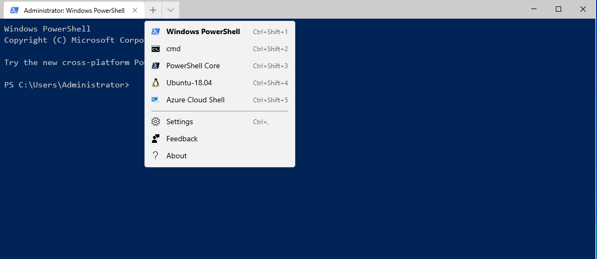

# packer-windows-10-insider

This version of my Windows packer template is tuned for Windows 10 insider builds. Realistically it should work with any build of Windows 10 18917 or higher. The builders I have configured here work with VMware Workstation Linux and Fusion. Note the VM system specs and adjust as needed for your system. 

## Newer Windows Goodies 
  * wsl2 https://docs.microsoft.com/en-us/windows/wsl/wsl2-faq
  * New Windows terminal https://github.com/microsoft/terminal
  * OpenSSH for Windows https://docs.microsoft.com/en-us/windows-server/administration/openssh/openssh_overview
  * PowerShell Core 6.2 or later https://github.com/PowerShell/PowerShell

## VMware Virtual Hardware Features
  * v16 Virtual Hardware
  * 4 Core CPU & 16GB RAM
  * UEFI Bios
  * Nested Virtualization enabled
  * Enable Virtualization Based Security
  * NVME Storage adapter
  * DirectX and OpenGL enabled

## Must Have Packages From Chocolatey
These are added via the [scripts/packages.ps1](scripts/packages.ps1) file. Adjust to taste.
  * autologon
  * notepadplusplus
  * 7zip
  * git
  * googlechrome
  * ultradefrag
  * sdelete


## Notes on building the template
The reader will need to source an appropriate .iso from Microsoft and place it into the iso directory. Additionally the first 3 variables listed in [windows-10-insider.json](windows-10-insider.json) need to be updated to match the iso and administrator pass you want. Additionally the Administrator password needs to updated to match in both [windows-10-insider.json](windows-10-insider.json) & [Autounattend.xml](Autounattend.xm.). 

Run this command to bake the full image. 
```bash
packer build -force -only full windows-10-insider.json
```

Running this command will bake just the OS install and bootstrap config. 
```bash
packer build -force -only base windows-10-insider.json
```

This command will fry an existing base image. This is super useful for re-running provisioners when debugging & testing them.
```bash
packer build -force -only full windows-10-insider.json
```
